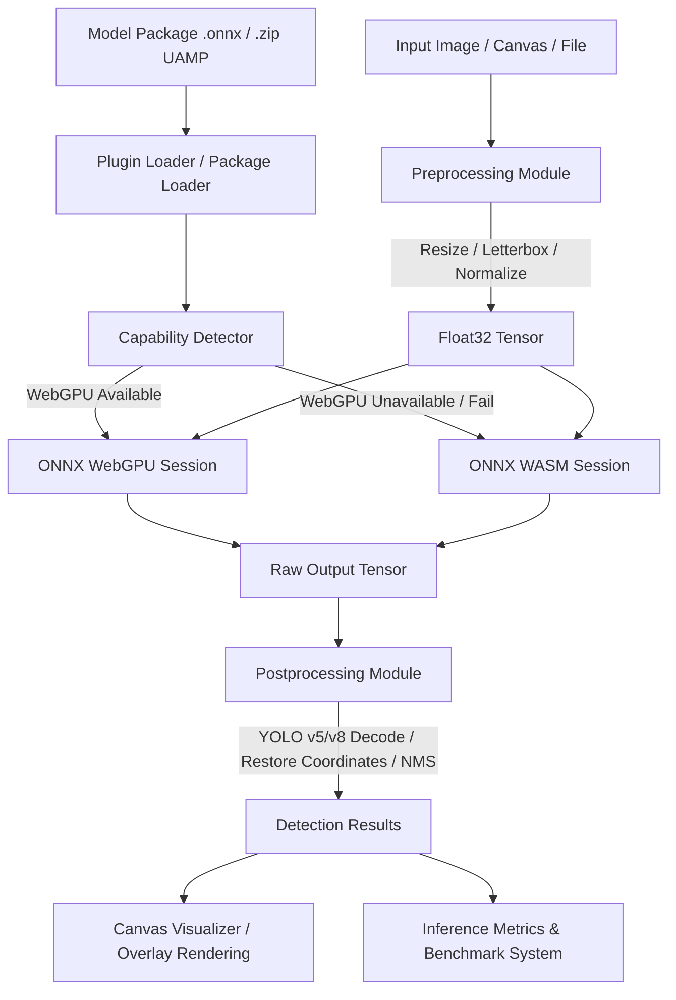

# InFera — Universal Inference Platform

InFera is a browser-first, framework-agnostic, and light-weight machine learning inference platform designed to run ONNX models natively in the client browser with WebGPU hardware acceleration and WebAssembly (WASM) fallbacks.

---

## 1. Architecture Diagram

The diagram below illustrates the platform flow from loading the model (either standalone or via the Universal Model Package) to preprocessing, execution, postprocessing, and visualization.



---

## 2. Feature Matrix

| Feature | Image Classification Plugin | Object Detection Plugin |
| :--- | :---: | :---: |
| **Model Formats** | ONNX | ONNX |
| **Execution Backends** | WASM | WebGPU / WASM (with Auto Fallback) |
| **Input Decoders** | Image, File | File, Blob, Image, ImageBitmap, ImageData |
| **Preprocessing** | Resize, Softmax/Normalize | Scaled Letterboxing, HWC to CHW Conversion |
| **Postprocessing** | Softmax, Top-K Sorting | Anchor-box Decoders (YOLOv5/v8), IoU, NMS |
| **Dynamic Shapes** | Yes | Yes (Auto NCHW Shape Scaling) |
| **ZIP Package Loader** | No | Yes (Universal Model Package - UAMP) |
| **Retina/DPI Scaling** | No | Yes (DevicePixelRatio Auto Scaling) |
| **Visualizer Overlay** | No | Yes (Bounding Boxes, Labels, cornerRadius) |
| **Latencies Benchmarking**| No | Yes (Preprocess, Inference, Postprocess tracking) |

---

## 3. Browser Compatibility Matrix

| Browser | WebAssembly (WASM) Backend | WebGPU Backend | Minimum Recommended Version |
| :--- | :---: | :---: | :---: |
| **Google Chrome** | ✅ Supported | ✅ Supported | Chrome 113+ |
| **Microsoft Edge** | ✅ Supported | ✅ Supported | Edge 113+ |
| **Opera** | ✅ Supported | ✅ Supported | Opera 99+ |
| **Mozilla Firefox**| ✅ Supported | ⚠️ Flag Enabled | Firefox 115+ (enable `dom.webgpu.enabled`) |
| **Apple Safari** | ✅ Supported | ⚠️ Experimental | Safari 17+ (enable WebGPU feature flag) |
| **Mobile Browsers**| ✅ Supported | ❌ Experimental | Android Chrome 121+ (iOS WebGPU experimental) |

---

## 4. WebGPU Support Table

| Operating System | Chrome / Edge | Firefox | Safari |
| :--- | :---: | :---: | :---: |
| **Windows** | ✅ Out-of-the-box (D3D12/Vulkan) | ⚠️ Under Flag | ❌ N/A |
| **macOS** | ✅ Out-of-the-box (Metal) | ⚠️ Under Flag | ⚠️ Experimental Flag |
| **Linux** | ✅ Out-of-the-box (Vulkan) | ⚠️ Under Flag | ❌ N/A |
| **Android** | ✅ Out-of-the-box (Vulkan) | ❌ N/A | ❌ N/A |
| **iOS / iPadOS** | ❌ N/A | ❌ N/A | ⚠️ Experimental Flag |

---

## 5. Performance Benchmark Table

*Typical execution latencies measured on an Intel Core i7 (12th Gen) / RTX 3060 Laptop GPU with a 640x640 input image size.*

| Backend | Preprocess Latency | Inference Latency | Postprocess Latency | Total Time | FPS |
| :--- | :---: | :---: | :---: | :---: | :---: |
| **WebAssembly (WASM)** | ~8 ms | ~120 ms | ~4 ms | ~132 ms | ~7.5 FPS |
| **WebAssembly SIMD** | ~8 ms | ~45 ms | ~4 ms | ~57 ms | ~17.5 FPS |
| **WebGPU (RTX 3060)** | ~8 ms | ~12 ms | ~4 ms | ~24 ms | **~41.6 FPS** |

---

## 6. Universal Model Package (UAMP) Specification

UAMP is a browser-native archive specification package (`.zip`) developed for packaging model binaries, labels, and configurations into a single deployable asset.

### Zip Archive Structure

```
model-package.zip
├── model.onnx           # ONNX model weights file (Required)
├── metadata.json        # Strict configuration details (Required)
├── labels.txt           # Line-separated plain text labels list (Optional)
├── labels.json          # Key-value map or array labels representation (Optional)
├── README.md            # Model description and licensing information (Optional)
└── thumbnail.png        # Icon or representative image of the model (Optional)
```

### Metadata JSON Schema (`metadata.json`)

```json
{
  "id": "yolov8n-coco",
  "name": "YOLOv8n Object Detection",
  "version": "1.0.0",
  "task": "object-detection",
  "inputShape": [1, 3, 640, 640],
  "architecture": "yolov8",
  "confidenceThreshold": 0.25,
  "iouThreshold: 0.45
}
```

### Security Guarantees
- **Zip Slip Protection**: Disallows entries with relative paths containing `../` or absolute root traversals.
- **Zip Bomb Defense**: Restricts decompression size to a maximum of 100MB per file entry to avoid memory allocation failures.
- **File Entry Ceiling**: Caps total entries to a maximum of 1,000 files to prevent resource exhaustion attacks.

---

## 7. Project Monorepo Layout

- **`apps/web-client`**: A web application built with React + Vite + TypeScript to run browser inference.
- **`packages/core`**: Base types, validation helpers, and plugin managers.
- **`packages/inference-engine`**: Low-level ONNX Runtime wrapper.
- **`packages/plugins/image-classification`**: Image classification plugin.
- **`packages/plugins/object-detection`**: High-performance object detection plugin with WebGPU fallbacks, UAMP zip loaders, canvas overlays, and benchmarks.

---

## 8. Development & Getting Started

### Prerequisites

- Node.js (v20+ recommended)
- `pnpm` (v11.8.0 recommended)

### Installation

```bash
pnpm install
```

### Workspace Validation Commands

```bash
# Build all packages in the workspace
pnpm build

# Run type check on all workspace packages
pnpm typecheck

# Run test suites in all workspace packages
pnpm test
```
