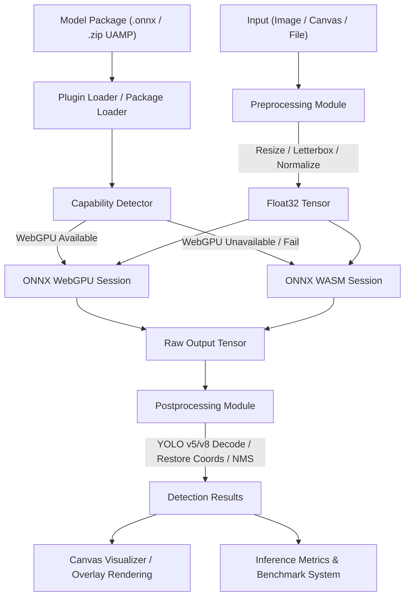

# InFera — Universal Inference Platform

[](https://github.com/FahroziAldinata/InFera-universal-inference-platform/actions/workflows/ci.yml)
[](https://www.npmjs.com/package/@infera/core)
[](https://www.npmjs.com/package/@infera/plugin-object-detection)
[](./LICENSE)
[](https://FahroziAldinata.github.io/InFera-universal-inference-platform/)

**InFera** adalah platform inferensi machine learning yang berjalan sepenuhnya di browser — browser-first, framework-agnostic, dipercepat WebGPU dengan fallback WASM otomatis.

> **Dibuat oleh Fahrozi Aldinata dan dukungan AI.**

📚 **[Baca Dokumentasi Lengkap →](https://FahroziAldinata.github.io/InFera-universal-inference-platform/)**

---

## 1. Diagram Arsitektur



---

## 2. Matriks Fitur

| Fitur | Plugin Image Classification | Plugin Object Detection |
| :--- | :---: | :---: |
| **Format Model** | ONNX | ONNX |
| **Backend Eksekusi** | WASM | WebGPU / WASM (Auto Fallback) |
| **Input yang Didukung** | Image, File | File, Blob, Image, ImageBitmap, ImageData |
| **Preprocessing** | Resize, Normalize | Scaled Letterboxing, HWC→CHW |
| **Postprocessing** | Softmax, Top-K | Anchor Decoder (YOLOv5/v8), IoU, NMS |
| **Dynamic Shapes** | Ya | Ya (Auto NCHW Shape Scaling) |
| **ZIP Package Loader** | Tidak | Ya (Universal Model Package — UAMP) |
| **Retina/DPI Scaling** | Tidak | Ya (DevicePixelRatio Auto Scaling) |
| **Visualizer Overlay** | Tidak | Ya (Bounding Box, Label, cornerRadius) |
| **Benchmark Latensi** | Tidak | Ya (Preprocess, Inference, Postprocess) |

---

## 3. Matriks Kompatibilitas Browser

| Browser | Backend WASM | Backend WebGPU | Versi Minimum |
| :--- | :---: | :---: | :---: |
| **Google Chrome** | ✅ | ✅ | Chrome 113+ |
| **Microsoft Edge** | ✅ | ✅ | Edge 113+ |
| **Opera** | ✅ | ✅ | Opera 99+ |
| **Mozilla Firefox** | ✅ | ⚠️ Perlu Flag | Firefox 115+ |
| **Apple Safari** | ✅ | ⚠️ Eksperimental | Safari 17+ |
| **Mobile Chrome** | ✅ | ✅ | Chrome 121+ |

---

## 4. Tabel Benchmark Performa

*Latensi tipikal diukur pada Intel Core i7 (Gen 12) / RTX 3060 Laptop GPU dengan ukuran input 640×640.*

| Backend | Latensi Preprocess | Latensi Inference | Latensi Postprocess | Total | FPS |
| :--- | :---: | :---: | :---: | :---: | :---: |
| **WebAssembly (WASM)** | ~8 ms | ~120 ms | ~4 ms | ~132 ms | ~7.5 FPS |
| **WebAssembly SIMD** | ~8 ms | ~45 ms | ~4 ms | ~57 ms | ~17.5 FPS |
| **WebGPU (RTX 3060)** | ~8 ms | ~12 ms | ~4 ms | ~24 ms | **~41.6 FPS** |

---

## 5. Universal Model Package (UAMP)

UAMP adalah spesifikasi paket model berbasis arsip `.zip` browser-native yang menyatukan bobot model, label, dan konfigurasi dalam satu file yang dapat di-deploy.

### Struktur Arsip

```
model-package.zip
├── model.onnx           # Bobot model ONNX (WAJIB)
├── metadata.json        # Konfigurasi lengkap (WAJIB)
├── labels.txt           # Label satu per baris (Opsional)
├── labels.json          # Label array/key-value (Opsional)
├── README.md            # Deskripsi model (Opsional)
└── thumbnail.png        # Gambar representatif (Opsional)
```

### Jaminan Keamanan
- **Zip Slip Protection** — Menolak path `../` dan traversal absolut
- **Zip Bomb Defense** — Batas dekompresi 100MB per entri
- **File Entry Ceiling** — Maksimal 1.000 entri per archive

📖 [Baca Spesifikasi UAMP Lengkap →](https://FahroziAldinata.github.io/InFera-universal-inference-platform/uamp/)

---

## 6. Layout Monorepo

```
InFera/
├── apps/
│   ├── web-client/          ← Aplikasi web React + Vite + TypeScript
│   └── docs/                ← Website dokumentasi VitePress
├── packages/
│   ├── core/                ← Tipe dasar, validasi, plugin manager
│   ├── inference-engine/    ← ONNX Runtime wrapper
│   └── plugins/
│       ├── object-detection/       ← Plugin object detection (YOLOv5/v8)
│       └── image-classification/   ← Plugin klasifikasi gambar
├── package.json             ← Root workspace (pnpm + Turborepo)
├── turbo.json               ← Build pipeline Turborepo
└── pnpm-workspace.yaml      ← Definisi workspace pnpm
```

---

## 7. Panduan Pengembangan

### Prasyarat

- Node.js v20+
- pnpm v11.8.0+
- Browser Chrome 113+ (untuk WebGPU)

### Instalasi

```bash
# Clone repository
git clone https://github.com/FahroziAldinata/InFera-universal-inference-platform.git
cd InFera-universal-inference-platform

# Instal semua dependensi
pnpm install
```

### Perintah Workspace

```bash
# Build semua package
pnpm build

# Type check semua package
pnpm typecheck

# Jalankan test suite
pnpm test

# Jalankan linter
pnpm lint

# Jalankan web client (mode development)
pnpm dev

# Build dokumentasi
pnpm docs:build

# Preview dokumentasi lokal
pnpm docs:preview
```

### Quick Start — Object Detection

```typescript
import { ObjectDetectionPlugin } from '@infera/plugin-object-detection';

const plugin = new ObjectDetectionPlugin({
  inputWidth: 640,
  inputHeight: 640,
  confidenceThreshold: 0.25,
  iouThreshold: 0.45,
  preferredBackend: 'auto',  // WebGPU jika tersedia, WASM sebagai fallback
  enableMetrics: true,
});

await plugin.init();
await plugin.loadModel(modelFile);

const result = await plugin.predict(imageElement);
console.log(result.detections); // [{ label: 'person', confidence: 0.89, ... }]
console.log(result.metrics);    // { inferenceTimeMs: 14.5, fps: 68.9, backend: 'webgpu' }
```

---

## 8. Dokumentasi

📚 Website dokumentasi lengkap tersedia di:

**[https://FahroziAldinata.github.io/InFera-universal-inference-platform/](https://FahroziAldinata.github.io/InFera-universal-inference-platform/)**

| Halaman | Link |
|---|---|
| Memulai | [/guide/getting-started](https://FahroziAldinata.github.io/InFera-universal-inference-platform/guide/getting-started) |
| Arsitektur | [/guide/architecture](https://FahroziAldinata.github.io/InFera-universal-inference-platform/guide/architecture) |
| Plugin Object Detection | [/plugins/object-detection](https://FahroziAldinata.github.io/InFera-universal-inference-platform/plugins/object-detection) |
| Plugin Image Classification | [/plugins/image-classification](https://FahroziAldinata.github.io/InFera-universal-inference-platform/plugins/image-classification) |
| Spesifikasi UAMP | [/uamp/](https://FahroziAldinata.github.io/InFera-universal-inference-platform/uamp/) |
| Benchmark | [/benchmark/](https://FahroziAldinata.github.io/InFera-universal-inference-platform/benchmark/) |
| Changelog | [/changelog/](https://FahroziAldinata.github.io/InFera-universal-inference-platform/changelog/) |

---

## 9. Kontribusi

Kontribusi sangat disambut! Silakan buka issue atau pull request di [GitHub repository](https://github.com/FahroziAldinata/InFera-universal-inference-platform).

---

## 10. Lisensi

InFera dirilis di bawah [Lisensi MIT](./LICENSE).

---

> **Dibuat oleh [Fahrozi Aldinata](https://github.com/FahroziAldinata) dan dukungan AI.**
