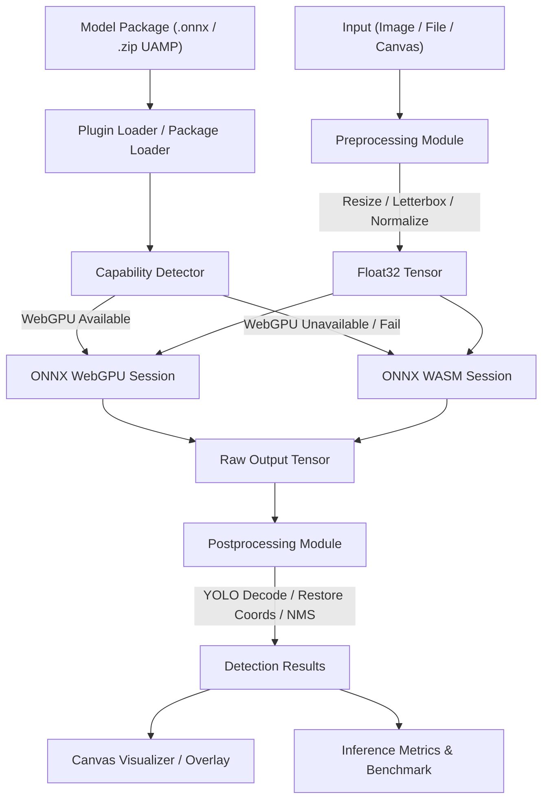

# Arsitektur Platform InFera

InFera dirancang dengan prinsip-prinsip utama: browser-first, framework-agnostic, progressive enhancement, dan graceful degradation.

## Gambaran Umum

```
┌─────────────────────────────────────────────────────────┐
│                     Aplikasi Pengguna                    │
│         (React / Vue / Angular / Vanilla JS)            │
└─────────────────────┬───────────────────────────────────┘
                       │
                       ▼
┌─────────────────────────────────────────────────────────┐
│                   @infera/core                           │
│   PluginManager · Types · Validation · Plugin Registry   │
└──────────────┬──────────────────────┬───────────────────┘
               │                      │
               ▼                      ▼
┌──────────────────────┐  ┌─────────────────────────────┐
│  Plugin: Object      │  │  Plugin: Image               │
│  Detection           │  │  Classification              │
│  @infera/plugin-     │  │  @infera/plugin-             │
│  object-detection    │  │  image-classification        │
└──────────┬───────────┘  └──────────────┬──────────────┘
           │                              │
           └──────────────┬───────────────┘
                          │
                          ▼
┌─────────────────────────────────────────────────────────┐
│              @infera/inference-engine                    │
│    OnnxRunner · Session Manager · Capability Detector    │
└──────────────┬──────────────────────┬───────────────────┘
               │                      │
               ▼                      ▼
┌──────────────────────┐  ┌─────────────────────────────┐
│   WebGPU Backend     │  │   WASM Backend               │
│   (GPU Native)       │  │   (Fallback Universal)       │
└──────────────────────┘  └─────────────────────────────┘
```

## Alur Inferensi Lengkap



## Paket-Paket Workspace

### `@infera/core`

Paket pondasi yang berisi:
- **Tipe dasar** — `Tensor`, `ModelFormat`, `InputType`, `InferenceResult<T>`, `ModelMetadata`
- **Plugin Manager** — Singleton registry untuk mendaftarkan dan mengelola plugin
- **Validation helpers** — `validateModelFile()`, `sanitizeOutputText()`

### `@infera/inference-engine`

Wrapper level rendah untuk ONNX Runtime Web:
- **OnnxRunner** — `loadModel()`, `warmup()`, `run()`, `dispose()`
- **Capability Detector** — Deteksi WebGPU, WASM SIMD, dan browser flags
- **Session Manager** — Pengelolaan sesi ONNX dengan backend selection otomatis

### `@infera/plugin-object-detection`

Plugin deteksi objek berfitur lengkap:
- **Preprocessing** — Scaled letterboxing, HWC→CHW conversion, normalization
- **Postprocessing** — YOLO v5/v8 decoder, koordinat restoration, IoU, NMS
- **UAMP Loader** — ZIP parser dengan keamanan Zip Slip dan Zip Bomb
- **Canvas Visualizer** — Bounding boxes, labels, pusat, overlay Retina-ready
- **Benchmark System** — Latensi preprocess/inference/postprocess, FPS, memori heap

### `@infera/plugin-image-classification`

Plugin klasifikasi gambar:
- **Preprocessing** — Resize, normalization
- **Postprocessing** — Softmax, Top-K sorting

### `apps/web-client`

Aplikasi web demo menggunakan React + Vite + TypeScript:
- **Zustand store** — State manajemen deteksi, viewport, dan toolbar
- **Interactive Canvas** — Hit-testing, zoom/pan, selection animation
- **Model Manager** — IndexedDB cache dengan LRU eviction (Dexie)
- **Export System** — JSON, CSV, COCO, YOLO, VOC, Label Studio

## Prinsip Desain

### 1. Browser-First
Semua inferensi berjalan di browser pengguna. Tidak ada server-side inference, tidak ada round-trip jaringan saat melakukan prediksi.

### 2. Progressive Enhancement
- WebGPU tersedia? Gunakan akselerasi GPU penuh.
- WebGPU tidak tersedia? Fallback otomatis ke WASM.
- WASM SIMD tersedia? Gunakan untuk performa lebih baik.
- Semua gagal? Fallback ke WASM standar.

### 3. Framework Agnostic
Paket `@infera/core`, `@infera/inference-engine`, dan semua plugin adalah library pure TypeScript tanpa dependensi pada React, Vue, atau framework lainnya.

### 4. Graceful Degradation
Setiap komponen memiliki strategi fallback:
- Backend: WebGPU → WASM SIMD → WASM
- Worker: Web Worker → Main Thread fallback
- Storage: IndexedDB → In-memory fallback

### 5. Fully Testable
Semua modul dapat diuji secara terpisah menggunakan Vitest dengan mock yang terisolasi dari browser API.

## Keamanan

### UAMP Security
- **Zip Slip Protection** — Menolak entri dengan path relatif `../` atau traversal absolut
- **Zip Bomb Defense** — Membatasi ukuran dekompresi maksimal 100MB per entri file
- **File Entry Ceiling** — Membatasi total entri maksimal 1.000 file

### Data Privacy
- Tidak ada data pengguna yang dikirim ke server eksternal
- Inferensi sepenuhnya offline setelah model diunduh
- Tidak ada telemetri atau logging ke layanan pihak ketiga
